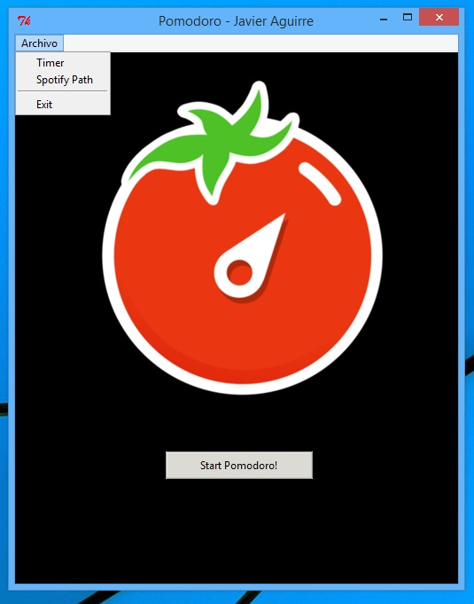
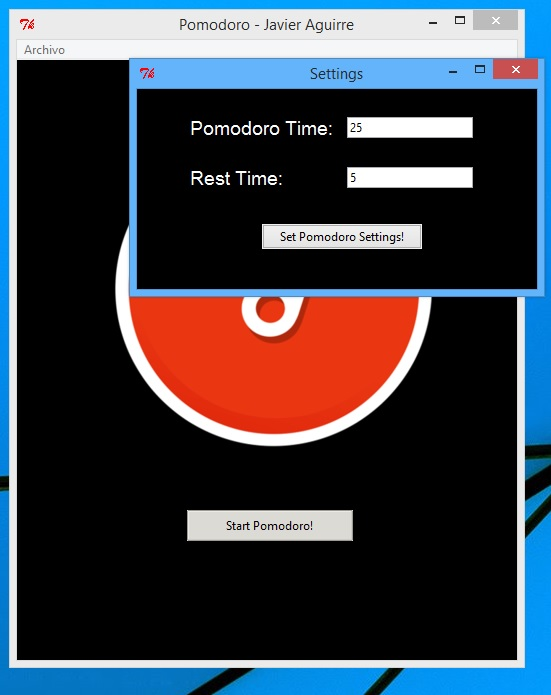
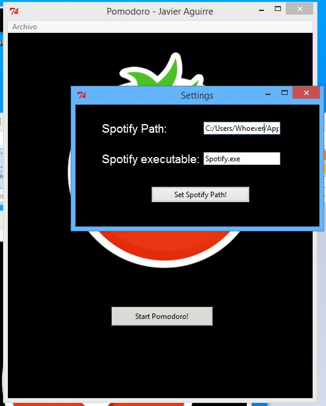
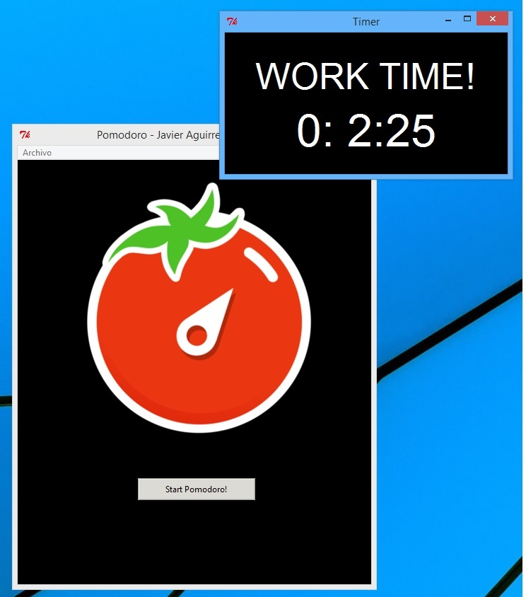
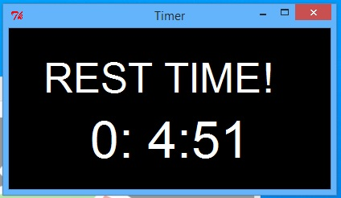

# Pomodoro-Timer-With-Spotify-Connection
A tool for study using pomodoro methodology, while study mode spotify or any other .exe app is opened and while resting is closed.

Main Interface:



You can set the pomodoro timer settings here:



You can set the Spotify or any other executable settings here so that when working time happens the executable is opened and closed while resting time:



Example of working time:



Example of rest time:



Installation:

Run .py file and mantain all the folder as it is.

If you want to have an executable file you can do the following on python terminal:

```
pip install pyinstaller
```
And in the anaconda prompt or other prompt

```
pyinstaller --onefile -w 'pomodoro.py'
```

This will create a dist folder with the .exe file of the app. Add to that directory the rest of the repository: .png, .mp3, .txt... 


Note:

Windows support is guaranteed (Not tested in Linux)
